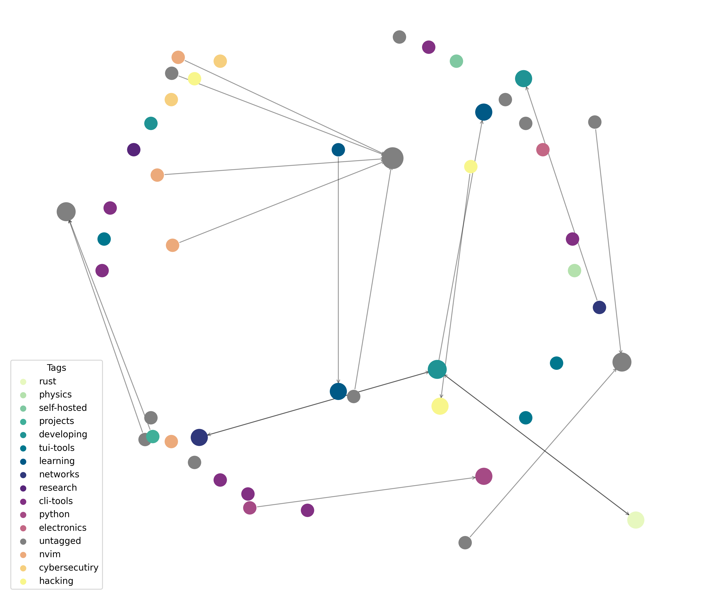

# zk-graph-view

Visualize your Zettelkasten graph from [`zk`](https://github.com/zk-org/zk) as an interactive HTML network.

`zk-graph-view` consumes the output of `zk graph --format=json` and renders it using `pyvis`.

[](https://github.com/cyberSapoPerro/zk-graph-view/releases/tag/v0.1.0/demo.mp4)

---

## Installation

```bash
git clone https://github.com/cyberSapoPerro/zk-graph-view.git
cd zk-graph-view
pipx install -e .
````

> Using `pipx` is recommended to isolate the CLI tool.

---

## Requirements

* [`zk`](https://github.com/zk-org/zk) installed and configured
* Python 3.13+

---

## Usage

Run the tool inside a valid `zk` notebook directory:

```bash
zk-graph-view
```

This will internally call:

```bash
zk graph --format=json
```

and generate an interactive HTML visualization.

### Static Graph

For large graphs (1k+ notes) or when you need a static image, use the `--static` flag:

```bash
zk-graph-view --static -o graph.png
```

This renders a high-resolution PNG using matplotlib with the same tag-based coloring and node sizing. The layout is computed automatically (Kamada-Kawai for small graphs, spring layout for larger ones).



---

## Configuration

You can integrate `zk-graph-view` as a `zk` alias for convenience.

Add this to your global config (`~/.config/zk/config.toml`) or a notebook-specific config:

```toml
[alias]
vis = "zk-graph-view"
```

Then run:

```bash
zk vis
```

---

## Notes

* The tool **must be executed inside a directory containing a `.zk/` folder**.
* Ensure your notes are properly tagged if you rely on tags for visualization or filtering.
* Interactive mode outputs HTML files; static mode outputs PNG images.
* Use `--help` to see all available options.
