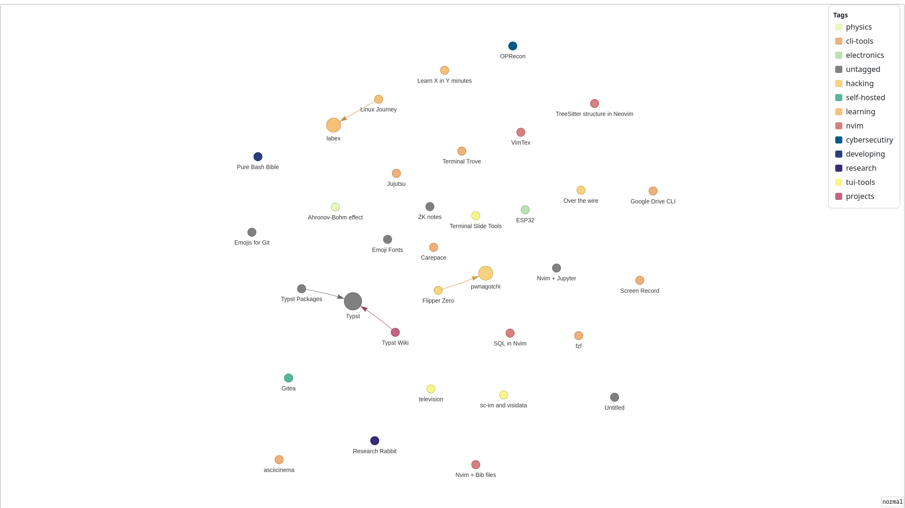

# zk-graph-view

Visualize your Zettelkasten graph from [`zk`](https://github.com/zk-org/zk) as an interactive HTML network.

`zk-graph-view` consumes the output of `zk graph --format=json` and renders it using `pyvis`.



---

## Installation

```bash
git clone https://github.com/<your-username>/zk-graph-view.git
cd zk-graph-view
pipx install -e .
````

> Using `pipx` is recommended to isolate the CLI tool.

---

## Requirements

* [`zk`](https://github.com/zk-org/zk) installed and configured
* Python 3.13+

---

## Usage

Run the tool inside a valid `zk` notebook directory:

```bash
zk-graph-view
```

This will internally call:

```bash
zk graph --format=json
```

and generate an interactive HTML visualization.

---

## Configuration

You can integrate `zk-graph-view` as a `zk` alias for convenience.

Add this to your global config (`~/.config/zk/config.toml`) or a notebook-specific config:

```toml
[alias]
viz = "zk-graph-view"
```

Then run:

```bash
zk viz
```

---

## Notes

* The tool **must be executed inside a directory containing a `.zk/` folder**.
* Ensure your notes are properly tagged if you rely on tags for visualization or filtering.
* Output HTML files can be opened in any modern browser.

--

## Licence

This project is licensed under the MIT License – see the [LICENSE](LICENSE) file for details.
