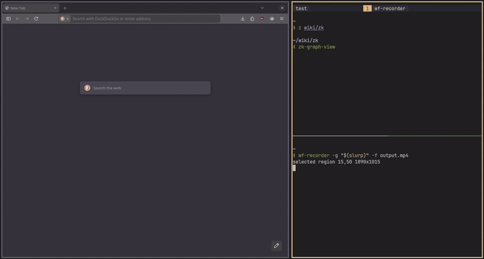

# zk-graph-view

Visualize your Zettelkasten graph from [`zk`](https://github.com/zk-org/zk) as an interactive HTML network.



---

## Features

- Node size determined by the number of connections.
- Interactive network visualization.
- Tags-based coloring and filtering.

---

## Installation

Using `pipx`

```bash
pipx install zk-graph-view
```

or using `uv`:

```bash
uv tool install zk-graph-view
```

> Using `uv` is recommended.

### Manual

```bash
git clone https://github.com/cyberSapoPerro/zk-graph-view.git
cd zk-graph-view
pipx install -e .
````

## Usage

Run the tool inside a valid `zk` notebook directory:

```bash
zk-graph-view
```

This will generate an interactive HTML visualization.
