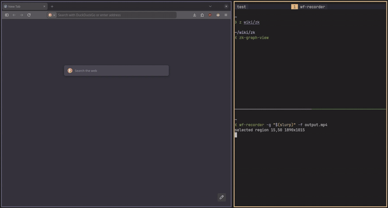

# zk-graph-view

**Turn your [zk](https://github.com/zk-org/zk) Zettelkasten into an interactive graph.**

`zk-graph-view` transforms the connections between your notes into a beautiful, interactive HTML network. Explore how your ideas connect, discover highly connected notes, and navigate your Zettelkasten visually.



## ✨ Features

* **Interactive graph** — Explore your Zettelkasten by dragging, zooming, and navigating between notes.
* **Connection-based node sizing** — Make highly connected notes stand out automatically.
* **Tag-based styling** — Color and filter notes based on their tags.
* **Directed or undirected graphs** — Choose how relationships between notes are represented.
* **Tags as nodes** — Optionally include tags in the graph to reveal another layer of connections.
* **Custom color palettes** — Choose the color palette that fits your workflow.
* **HTML export** — Save your visualization as a standalone HTML file.
* **Clickable notes** — Open notes directly in your browser by clicking their nodes.

## 🚀 Quick start

Install `zk-graph-view` with your preferred Python tool.

### Using `uv` — recommended

```bash
uv tool install zk-graph-view
```

### Using `pipx`

```bash
pipx install zk-graph-view
```

Then run it from inside your [`zk`](https://github.com/zk-org/zk) notebook:

```bash
zk-graph-view
```

An interactive HTML visualization of your Zettelkasten will be generated automatically.

## 🔍 Use it with `zk` queries

`zk-graph-view` can consume the JSON output of `zk`, allowing you to combine it with `zk`'s query capabilities.

For example, to visualize only notes with a specific tag:

```bash
zk graph -t a-tag --format=json | zk-graph-view
```

This generates a graph containing only the notes tagged with `a-tag`.

You can use the same approach with other `zk` queries to create focused views of your knowledge base.

## 🧪 Install the latest version

If you want to try the latest version directly from the repository, including features that may not yet be available in the latest release:

```bash
uv tool install git+https://github.com/cyberSapoPerro/zk-graph-view
```

## 💡 Why?

A Zettelkasten is fundamentally a network of ideas. Reading your notes as a list is useful, but sometimes you want to see the **structure of your knowledge**.

`zk-graph-view` gives you a visual way to:

* spot highly connected notes,
* discover clusters of related ideas,
* explore connections you might have overlooked, and
* understand how your Zettelkasten evolves over time.

## 📖 About

Built to work with [zk](https://github.com/zk-org/zk), the command-line Zettelkasten tool.

Found a bug or have an idea for a feature? Feel free to [open an issue](https://github.com/cyberSapoPerro/zk-graph-view/issues) or contribute!

